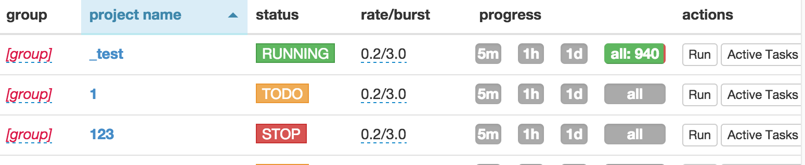

快速入门
==========

安装pyspider
------------

* 在LINUX终端里执行`pip install pyspider`安装pyspider。
* 安装完执行命令 `pyspider`启动, 访问 [http://localhost:5000/](http://localhost:5000/)查看是否启动成功。

如果您使用的是UBUNTU操作系统，在安装pyspider前需要执行以下命令安装依赖包:
```
apt-get install python python-dev python-distribute python-pip libcurl4-openssl-dev libxml2-dev libxslt1-dev python-lxml
```

**注意:** `pyspider` 命令是启动pyspider的默认模式，默认模式是所有的组件都以本地模式执行并且所有组件都启动。如果想线上运行或调试请参考部署章节 [Deployment](部署).

你的第一个爬虫脚本
-----------------

```python
from pyspider.libs.base_handler import *


class Handler(BaseHandler):
    crawl_config = {
    }

    @every(minutes=24 * 60)
    def on_start(self):
        self.crawl('http://scrapy.org/', callback=self.index_page)

    @config(age=10 * 24 * 60 * 60)
    def index_page(self, response):
        for each in response.doc('a[href^="http"]').items():
            self.crawl(each.attr.href, callback=self.detail_page)

    @config(priority=2)
    def detail_page(self, response):
        return {
            "url": response.url,
            "title": response.doc('title').text(),
        }
```

> * `def on_start(self)` 是脚本的入口. 当你在控制台点击 `run` 时程序会执行此处。
> * [`self.crawl(url, callback=self.index_page)`*](/apis/self.crawl) 调用爬虫的一个非常重要的api接口. 调用这个接口会添加一个新的爬取任务。
> * `def index_page(self, response)` 传入一个 [`Response`*](/apis/Response) 对像. [`response.doc`*](/apis/Response/#responsedoc) 是一个 [pyquery](https://pythonhosted.org/pyquery/) 对像并且可以使用扩展API选择元素。
> * `def detail_page(self, response)` 返回一个 `dict` 对象做为结果. 这个结果默认会保存到`resultdb`数据库. 你可以重写 `on_result(self, result)` 方法输出到其它数据库或是api。


你可能需要知道更多的相关知识:

> * [`@every(minutes=24*60, seconds=0)`*](/apis/@every/) 这个配置是告诉schedule（也就是调度器）多长时间执行一次 `on_start` 方法。
> * [`@config(age=10 * 24 * 60 * 60)`*](/apis/self.crawl/#configkwargs) 这个配置是告诉scheduler（调度器）在多长时间（单位是秒）内不再执行这个任务。[`age`*](/apis/self.crawl/#schedule)参数也可以用于 `self.crawl(url, age=10*24*60*60)` 和 `crawl_config`。
> * [`@config(priority=2)`*](/apis/self.crawl/#schedule) 这个priority参数可以改变任务的优先级。本案例中是提高详情页的优先级。

你可以点击`run`按钮来单步运行并测试你的脚本，并切换到`follows`面板点击播放按钮继续单步执行。


启动爬虫
-------------

1. 保存你编写的脚本。
2. 返回到控制台并找到你刚编辑的项目。
3. 修改任务状态为 `DEBUG` or `RUNNING`（直接点击项目的状态可修改状态）。
4. 点击`run`按钮启动爬虫开始抓取。



如果你按上面的步骤操作完了，那么恭喜你，你的爬虫已经开始工作了。
